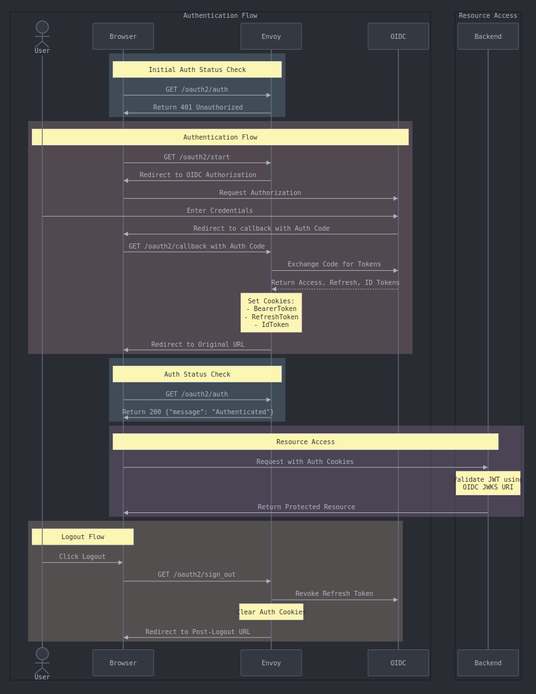

# Envoy OAuth2 Middleware PoC

A proof of concept demonstrating how to use Envoy as an OAuth2 middleware for authentication. This implementation provides a containerized Envoy proxy configured as an authentication layer, deployed using Helm on Kubernetes.

## Overview

This PoC showcases Envoy's capabilities as an authentication middleware with the following features:
- OAuth2 Authorization Code Flow using client credentials
- Token management through secure cookies
- Automatic token refresh handling
- Sign-out flow with refresh token revocation
- CORS and security headers management

## Notes

- Refresh token revocation during sign-out is currently only implemented for AWS Cognito as the identity provider

## Authentication Flow



## Endpoints

- `/oauth2/start` - Initiates the OAuth2 authentication flow by redirecting to the identity provider
- `/oauth2/callback` - Handles the OAuth2 callback, processes tokens, and sets secure cookies
- `/oauth2/auth` - Verifies the current authentication status and returns 200 if authenticated
- `/oauth2/userinfo` - Proxies requests to the identity provider's userinfo endpoint with the current access token
- `/oauth2/sign_out` - Handles the sign-out process by revoking tokens and clearing authentication cookies
- `/healthz` - Simple health check endpoint that returns 200 if Envoy is running

## Repository Structure

```
.
├── README.md                                                   # This file
├── auth-flow.png                                               # Authentication flow sequence diagram
├── chart/envoy-oauth2-middleware                               # Helm chart for deploying the middleware
└── chart/envoy-oauth2-middleware/templates/_envoy.tpl          # Envoy configuration template
```